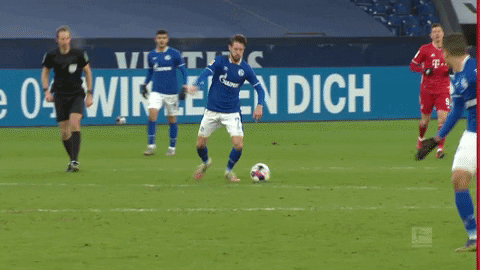

# SOA Case Study 2022: Rarita's National Football Team ⚽

---
## Project Outline

The goal of this assignment was to formulate a comprehensive plan for Rarita (a fictional country) to construct an internationally competitive football team. Criteria for a "competitive" team was defined as:
>1. Rank within the top 10 members of the FSA for the season within the next 5 years.
>2. Have a high probability of achieving an FSA championship within the next 10 years.

The potential economic impacts of the team were also assessed, and given the uncertainty involved in such a venture, a thorough risk analysis was conducted, highlighting the key risks, impacts, and potential risk mitigation measures. 

## Team Selection
@ Callum
## Implementation Plan
@ Prav and Yatty
## Economic Impact
@ Karina
## Risk Considerations
Forming a competative football team is a difficult undertaking and is subject to a broad range of risks. A risk analysis was completed to identify key risks faced by the team, the potential impact, and measures to mitigate the risk. 
#### Player Misconduct. 
Anti-social behaviour (both on and off-field) represented a considerable financial (quantitative) and reputation (qualitative) risk to Rarita. Experience from other sporting codes suggested the likelihood of severe misconduct by a player within the team is likely within the next 5 years. An incident could impact:
* Sponsor share prices. 
* Broadcasting revenue.
* Ticket sales. 
* Rarita's international tourism. 

Transfering or removing this risk was not possible. However, establishing a strict Player Code of Conduct (with enforceable penalties) to govern on and off-field behaviour was advised as a means to mitigate the risk. This would aid in reducing the frequency and severity of incidents. 

#### Poor Public Opinion
Though difficult to quantify, a lack of public support for Rarita’s national team and the investment would have considerable economic and political consequences for Rarita, and was identifed as another key risk. 
Potential impacts could be:
* Social and Politcal Unrest.
* Wasted public spending, and the foregone benefits of other investment such as in education or healthcare.
* Low broadcasting & ticket sale revenue. 

To mitigate this risk, it was advised to conduct focus groups, and liaise with key stakeholders in the community, to ensure the investment and national team’s introduction aligns with their broader interests.

# Delete below this before submission. Keep for now as a template for formatting. 

### Congrats on completing the [2022 SOA Research Challenge](https://www.soa.org/research/opportunities/2022-student-research-case-study-challenge/)!

>Now it's time to build your own website to showcase your work.  
>To create a website on GitHub Pages to showcase your work is very easy.

This is written in markdown language. 
>
* Click [4001 link](https://classroom.github.com/a/ggiq0YzO) to accept your group assignment.
* Click [5100 link](https://classroom.github.com/a/uVytCqDv) to accept your group assignment 

#### Follow the [guide doc](Doc1.pdf) to submit your work. 
---
>Be creative! Feel free to link to embed your [data](player_data_salaries_2020.csv), [code](sample-data-clean.ipynb), [image](ACC.png) here

More information on GitHub Pages can be found [here](https://pages.github.com/)

